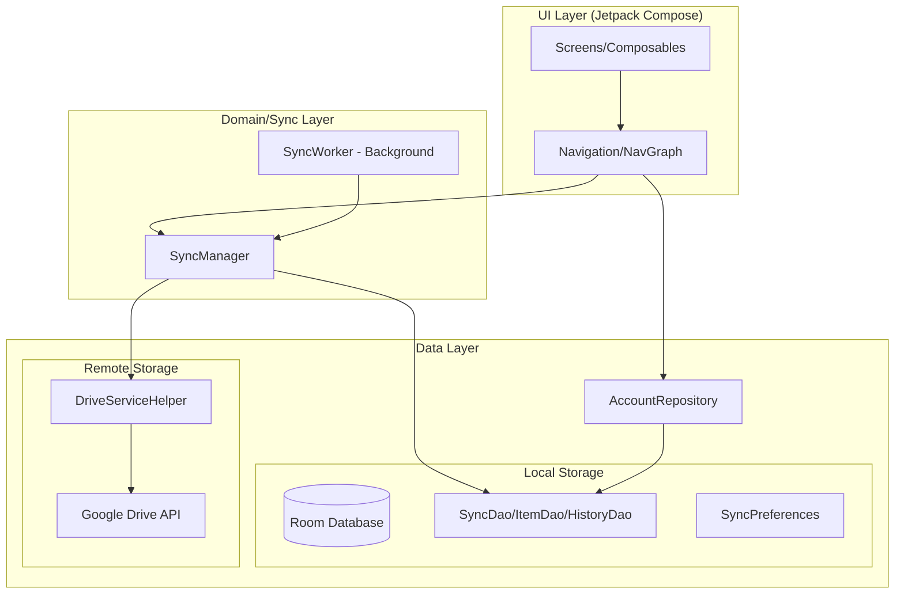

# Google Drive Sync 상세 코드 및 구조 가이드

이 문서는 Google Drive Sync 애플리케이션의 전체 아키텍처, 패키지 구조, 그리고 각 구성 요소의 상세 역할을 설명합니다.

---

## 1. 전체 아키텍처 개요

본 프로젝트는 **MVVM (Model-View-ViewModel)** 패턴과 **Clean Architecture** 원칙을 기반으로 설계되었습니다. 데이터 계층, 비즈니스 로직 계층, UI 계층이 명확히 분리되어 있습니다.

### 1.1. 시스템 아키텍처 다이어그램

---

## 2. 상세 패키지 구조 및 구성 요소

### 2.1. `uk.xmlangel.googledrivesync` (Root)

- **`MainActivity.kt`**: 앱의 메인 엔트리 포인트. 테마 적용, 내비게이션 초기화, 동적 권한 요청 및 백그라운드 작업 스케줄링을 담당합니다.

### 2.2. `data` (데이터 계층)

데이터의 영속성 관리 및 외부 API 통신을 담당합니다.

- **`data.drive`**: Google Drive API와의 저수준 통신 레이어.
  - `DriveServiceHelper.kt`: 인증, 파일 업로드/다운로드, 목록 조회 등 Drive API 호출을 캡슐화합니다.
- **`data.local`**: 로컬 DB 및 설정 관리.
  - `SyncDatabase.kt`: Room DB의 메인 홀더.
  - `SyncDao.kt`: 폴더, 아이템, 히스토리에 대한 SQL 쿼리 정의.
  - `SyncEntities.kt`: DB 테이블 구조 정의.
  - `SyncPreferences.kt`: 자동 동기화 주기, Wi-Fi 전용 등 사용자 설정 저장.
- **`data.model`**: 앱 전반에서 사용하는 공통 데이터 모델.
  - `SyncStatus`, `SyncDirection`, `SyncConflict` 등 동기화 상태 및 설정을 위한 Enum과 Data 클래스.
- **`data.repository`**: UI에서 데이터에 접근할 때 사용하는 브리지 레이어.
  - `AccountRepository.kt`: 연결된 Google 계정 정보를 관리하고 현재 활성화된 계정을 추적합니다.

### 2.3. `sync` (비즈니스 로직 및 작업 계층)

동기화의 핵심 로직과 백그라운드 처리를 담당합니다.

- **`SyncManager.kt`**:
  - 로컬과 서버의 차이점을 계산(Diffing).
  - 수정 시간(Timestamp) 기반의 충돌 감지 로직.
  - 업로드/다운로드 큐 관리.
- **`SyncWorker.kt`**:
  - `WorkManager`를 사용하여 앱이 종료된 상태에서도 주기적으로 동기화를 수행.
  - 네트워크 상태, 충전 상태 등 제약 조건을 확인하여 실행.

### 2.4. `ui` (프레젠테이션 계층)

Jetpack Compose를 사용한 사용자 인터페이스 구성입니다.

- **`ui.navigation`**: `NavGraph.kt`를 통해 각 화면 간의 이동 경로와 의존성 주입을 정의합니다.
- **`ui.screens`**: 각 기능별 독립적인 화면 단위 (대시보드, 계정 관리, 설정, 로그 등).
- **`ui.theme`**: Material3 기반의 색상, 타이포그래피, 테마 설정.

---

## 3. 핵심 기능별 데이터 흐름 (Data Flow)

### 3.1. 양방향 동기화 프로세스 flow

1. **시작**: `SyncManager.syncFolder(folderId)` 호출.
2. **데이터 취득**: 로컬 파일(`File.listFiles`)과 드라이브 파일(`driveHelper.listFiles`)을 동시에 스캔.
3. **비교 (Comparing)**:
    - **신규 파일**: 한쪽에만 있는 파일은 반대편으로 전달(업로드/다운로드).
    - **업데이트**: 양쪽에 모두 있으나 수정 시간이 다른 경우 최신 버전으로 덮어씀.
    - **충돌**: 마지막 동기화 이후 양쪽이 모두 수정된 경우 사용자의 판단을 기다리거나 설정된 규칙에 따름.
4. **DB 업데이트**: 작업 완료 후 `SyncItemEntity`와 `SyncHistoryEntity`에 결과 기록.
5. **피드백**: `syncProgress` StateFlow를 통해 실시간 진행 상황을 UI에 노출.

---

## 4. 각 구성별 상세 설명 및 코드 포인트

### 4.1. `SyncManager`의 충돌 해결 전략

`resolveConflict` 메서드는 다음 4가지 전략을 구현합니다:

- `USE_LOCAL`: 로컬 파일을 드라이브에 강제로 덮어씌움.
- `USE_DRIVE`: 드라이브 파일을 로컬에 강제로 덮어씌움.
- `KEEP_BOTH`: 로컬 파일의 이름을 변경(`_local` 접미사)하여 둘 다 보존.
- `SKIP`: 아무 작업도 하지 않고 다음 파일로 진행.

### 4.2. `SyncWorker`의 실행 제약 조건

`PeriodicWorkRequestBuilder`를 생성할 때 다음과 같은 제약(`Constraints`)을 적용할 수 있습니다:

- `setRequiredNetworkType(NetworkType.UNMETERED)`: Wi-Fi 연결 시에만 실행.
- `setRequiresCharging(true)`: 배터리 소모를 방지하기 위해 충전 중에만 실행.

### 4.3. `DriveServiceHelper`의 계정 전환

단일 앱에서 여러 계정을 지원하기 위해, 각 요청마다 `initializeDriveService(accountEmail)`를 호출하여 해당 계정의 `GoogleAccountCredential`을 동적으로 교체합니다.

---

## 5. 결론 및 유지보수 팁

- 새로운 파일 형식을 지원하려면 `SyncManager.getMimeType`에 MIME 매핑을 추가하십시오.
- UI 화면을 추가하려면 `Screen` 실드 클래스에 경로를 정의하고 `NavGraph`에 `composable` 블록을 구성하십시오.
- DB 스키마가 변경되면 `SyncDatabase`의 버전 상향 및 Migration 로직 작성이 필요합니다.
