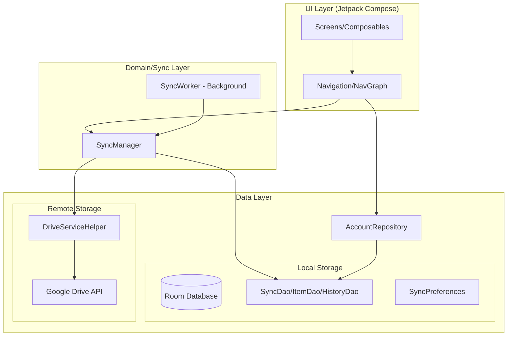

# Google Drive Sync: Detailed Code & Structure Guide

This document provides a comprehensive overview of the Google Drive Sync application's architecture, package structure, and the detailed roles of each component.

---

## 1. Architecture Overview

The project is designed based on the **MVVM (Model-View-ViewModel)** pattern and **Clean Architecture** principles. The data layer, business logic layer, and UI layer are clearly separated.

### 1.1. System Architecture Diagram

---

## 2. Detailed Package Structure & Components

### 2.1. `uk.xmlangel.googledrivesync` (Root)

- **`MainActivity.kt`**: The main entry point of the app. Responsible for applying themes, initializing navigation, requesting dynamic permissions, and scheduling background tasks.

### 2.2. `data` (Data Layer)

Handles data persistence and communication with external APIs.

- **`data.drive`**: Low-level communication layer with the Google Drive API.
  - `DriveServiceHelper.kt`: Encapsulates Drive API calls such as authentication, file upload/download, and listing files.
- **`data.local`**: Local database and settings management.
  - `SyncDatabase.kt`: Main holder for the Room database.
  - `SyncDao.kt`: SQL query definitions for folders, items, and history.
  - `SyncEntities.kt`: Definitions for DB table structures.
  - `SyncPreferences.kt`: Stores user settings like auto-sync intervals and Wi-Fi-only options using SharedPreferences.
- **`data.model`**: Common data models used throughout the app.
  - Enums and data classes for sync status (`SyncStatus`), direction (`SyncDirection`), and conflicts (`SyncConflict`).
- **`data.repository`**: Bridge layer used by the UI to access data.
  - `AccountRepository.kt`: Manages connected Google account information and tracks the currently active account.

### 2.3. `sync` (Business Logic & Work Layer)

Responsible for core sync logic and background processing.

- **`SyncManager.kt`**:
  - Calculates differences between local and server files (Diffing).
  - Contains timestamp-based conflict detection logic.
  - Manages upload/download queues.
- **`SyncWorker.kt`**:
  - Uses `WorkManager` to perform periodic syncs even when the app is closed.
  - Checks constraints such as network status and charging status before execution.

### 2.4. `ui` (Presentation Layer)

User interface components built using Jetpack Compose.

- **`ui.navigation`**: Defines screen navigation paths and dependency injection via `NavGraph.kt`.
- **`ui.screens`**: Independent screen units for each feature (Dashboard, Account Management, Settings, Logs, etc.).
- **`ui.theme`**: Theme settings based on Material3, including colors and typography.

---

## 3. Core Feature Data Flow

### 3.1. Bidirectional Sync Process Flow

1. **Start**: `SyncManager.syncFolder(folderId)` is called.
2. **Data Acquisition**: Scans local files (`File.listFiles`) and Drive files (`driveHelper.listFiles`) simultaneously.
3. **Comparison (Diffing)**:
    - **New Files**: Files existing only on one side are transferred to the other (Upload/Download).
    - **Updates**: If a file exists on both sides but has different modification times, it is overwritten with the latest version.
    - **Conflicts**: If both sides have been modified since the last sync, it waits for user judgment or follows pre-configured rules.
4. **DB Update**: Results are recorded in `SyncItemEntity` and `SyncHistoryEntity` after the operation.
5. **Feedback**: Real-time progress is exposed to the UI via the `syncProgress` StateFlow.

---

## 4. Component Deep Dive & Code Points

### 4.1. Conflict Resolution Strategies in `SyncManager`

The `resolveConflict` method implements four strategies:

- `USE_LOCAL`: Overwrites the Drive file with the local version.
- `USE_DRIVE`: Overwrites the local file with the Drive version.
- `KEEP_BOTH`: Keeps both by renaming the local file (appending `_local`).
- `SKIP`: Does nothing and proceeds to the next file.

### 4.2. `SyncWorker` Execution Constraints

Constraints can be applied when creating the `PeriodicWorkRequestBuilder`:

- `setRequiredNetworkType(NetworkType.UNMETERED)`: Executes only when connected to Wi-Fi.
- `setRequiresCharging(true)`: Executes only while charging to prevent battery drain.

### 4.3. Account Switching in `DriveServiceHelper`

To support multiple accounts in a single app, `initializeDriveService(accountEmail)` is called for each request to dynamically switch the `GoogleAccountCredential` for the specific account.

---

## 5. Maintenance Tips

- To support new file types, add MIME mappings to `SyncManager.getMimeType`.
- To add a new UI screen, define the path in the `Screen` sealed class and configure a `composable` block in `NavGraph`.
- If the DB schema changes, increment the `SyncDatabase` version and implement migration logic.
