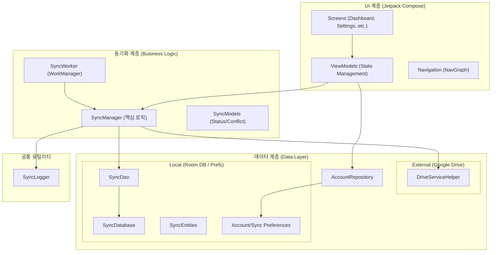

# Google Drive Sync - 프로젝트 아키텍처 및 테스트 계획

이 문서는 Google Drive Sync 프로젝트의 전체 구조, 기능 리스트, 그리고 로컬 단위 테스트 계획을 정리한 문서입니다.

## 1. 프로젝트 아키텍처 도식화



---

## 2. 주요 파일 상세 설명

### 데이터 계층 (`data/`)

- **`drive/DriveServiceHelper.kt`**: Google Drive API의 래퍼 클래스로, 인증, 파일 목록 조회, 업로드, 다운로드 등을 담당합니다.
- **`local/SyncDatabase.kt`**: Room 데이터베이스 메인 홀더입니다.
- **`local/SyncDao.kt`**: 데이터 접근을 위한 인터페이스(Folder, Item, History).
- **`local/SyncEntities.kt`**: DB 테이블 구조를 정의하는 엔티티 클래스.
- **`local/AccountPreferences.kt` / `SyncPreferences.kt`**: 암호화된 설정을 관리합니다.
- **`repository/AccountRepository.kt`**: 데이터 소스로부터 계정 정보를 제공하는 저장소.
- **`model/GoogleAccount.kt`**: 구글 계정 데이터 모델.

### 동기화 계층 (`sync/`)

- **`SyncManager.kt`**: 핵심 비즈니스 로직(양방향 동기화, 충돌 감지/해결 정책).
- **`SyncModels.kt`**: 동기화 상태, 결과, 충돌 정보를 정의하는 모델.
- **`SyncWorker.kt`**: WorkManager를 사용한 주기적 백그라운드 동기화.

### UI 계층 (`ui/`)

- **`navigation/NavGraph.kt`**: 앱의 화면 전환 구조 정의.
- **`screens/DashboardScreen.kt`**: 메인 대시보드 및 폴더 목록.
- **`screens/AccountScreen.kt`**: 연동 계정 관리.
- **`screens/SyncSettingsScreen.kt`**: 동기화 설정 편집.
- **`screens/FolderBrowserScreen.kt`**: 구글 드라이브 원격 폴더 탐색.
- **`screens/LocalFolderPickerScreen.kt`**: 기기 내 로컬 폴더 선택.
- **`screens/SyncLogScreen.kt`**: 동기화 이력 및 상세 로그 확인.
- **`screens/SyncedFolderFileScreen.kt`**: 파일별 동기화 상태 확인.
- **`theme/`**: Color, Theme, Type 등 디자인 시스템 정의.

### 기타

- **`MainActivity.kt`**: 앱 진입점, 권한 처리 및 탐색 초기화.
- **`util/SyncLogger.kt`**: 동기화 과정 로그 기록 유틸리티.

---

## 3. 기능 리스트 및 테스트 항목

| 기능 분류 | 주요 기능 | 상세 테스트 항목 (Unit Test) |
| :--- | :--- | :--- |
| **계정 관리** | Google Drive 인증 및 계정 전환 | • 계정 정보 저장/로드 유효성 검사 <br> • 계정 삭제 시 관련 데이터 연쇄 삭제 여부 |
| **동기화 설정** | 폴더 쌍 구성 (Local ↔ Drive) | • 폴더 경로 및 ID 유효성 검증 <br> • 활성화된 폴더만 필터링 기능 확인 |
| **동기화 엔진** | 양방향 동기화 (파일 업/다운로드) | • 로컬/드라이브 파일 변경 감지 로직 <br> • 동기화 상태 업데이트 검증 <br> • `getMimeType` 확장자 매핑 정확도 |
| **충돌 해결** | 파일 충돌 감지 및 해결 전략 | • `ResolveConflict`: 로컬 유지, 드라이브 유지, 이름 변경 후 둘 다 유지 로직 검증 |
| **이력 관리** | 동기화 로그 및 결과 기록 | • 성공/실패 시 이력 데이터 생성 확인 <br> • `SyncDao` 쿼리 결과 검증 |

---

## 4. 테스트 환경 설정 (예정)

### 추가 라이브러리

- `MockK`: 모킹 프레임워크.
- `Kotlinx Coroutines Test`: 비동기 코드 테스트 유틸리티.
- `Turbine`: Flow 테스트 라이브러리.

### 실행 방법

```bash
./gradlew test
```
